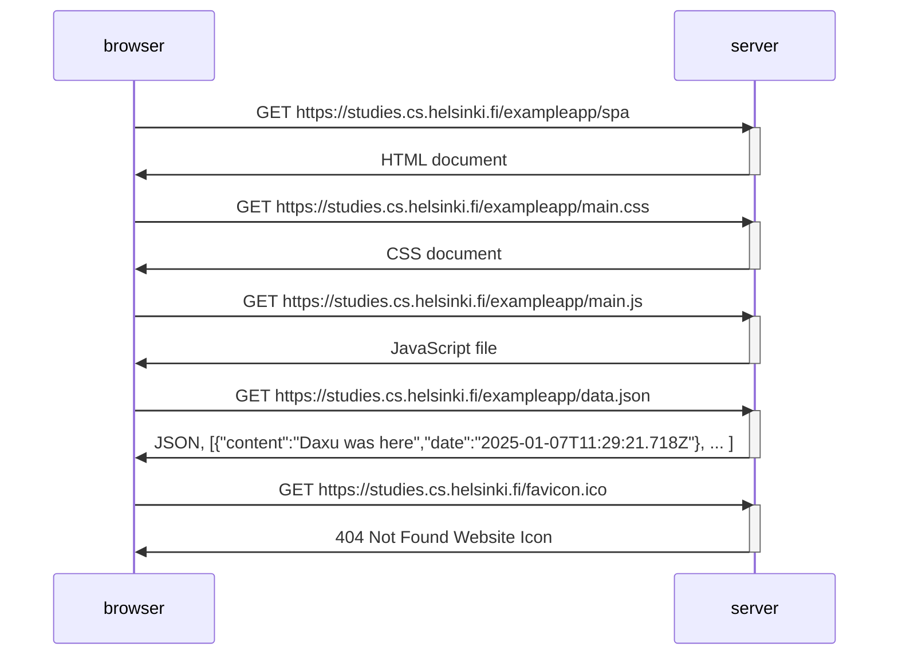

```mermaid
sequenceDiagram
    participant browser
    participant server

    browser->>server: GET https://studies.cs.helsinki.fi/exampleapp/spa
    activate server
    server->>browser: HTML document
    deactivate server

    browser->>server: GET https://studies.cs.helsinki.fi/exampleapp/main.css
    activate server
    server->>browser: CSS document
    deactivate server

    browser->>server: GET https://studies.cs.helsinki.fi/exampleapp/main.js
    activate server
    server->>browser: JavaScript file
    deactivate server

    browser->>server: GET https://studies.cs.helsinki.fi/exampleapp/data.json
    activate server
    server->>browser: JSON, [{"content":"Daxu was here","date":"2025-01-07T11:29:21.718Z"}, ... ]
    deactivate server


    browser->>server: GET https://studies.cs.helsinki.fi/favicon.ico
    activate server
    server->>browser: 404 Not Found Website Icon
    deactivate server
```
