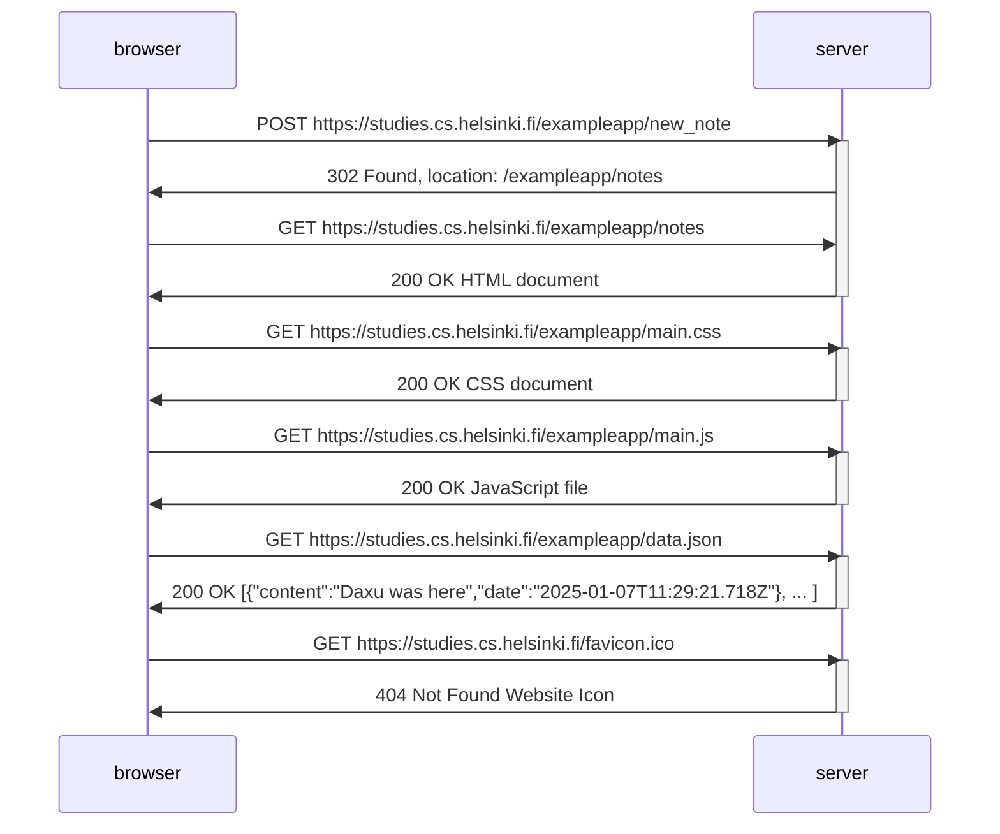

```mermaid
sequenceDiagram
    participant browser
    participant server

    browser->>server: POST https://studies.cs.helsinki.fi/exampleapp/new_note
    activate server
    server->>browser: 302 Found, location: /exampleapp/notes
    browser->>server: GET https://studies.cs.helsinki.fi/exampleapp/notes
    server->>browser: 200 OK HTML document
    deactivate server

    browser->>server: GET https://studies.cs.helsinki.fi/exampleapp/main.css
    activate server
    server->>browser: 200 OK CSS document
    deactivate server

    browser->>server: GET https://studies.cs.helsinki.fi/exampleapp/main.js
    activate server
    server->>browser: 200 OK JavaScript file
    deactivate server


    browser->>server: GET https://studies.cs.helsinki.fi/exampleapp/data.json
    activate server
    server->>browser: 200 OK [{"content":"Daxu was here","date":"2025-01-07T11:29:21.718Z"}, ... ]
    deactivate server


    browser->>server: GET https://studies.cs.helsinki.fi/favicon.ico
    activate server
    server->>browser: 404 Not Found Website Icon
    deactivate server
```
